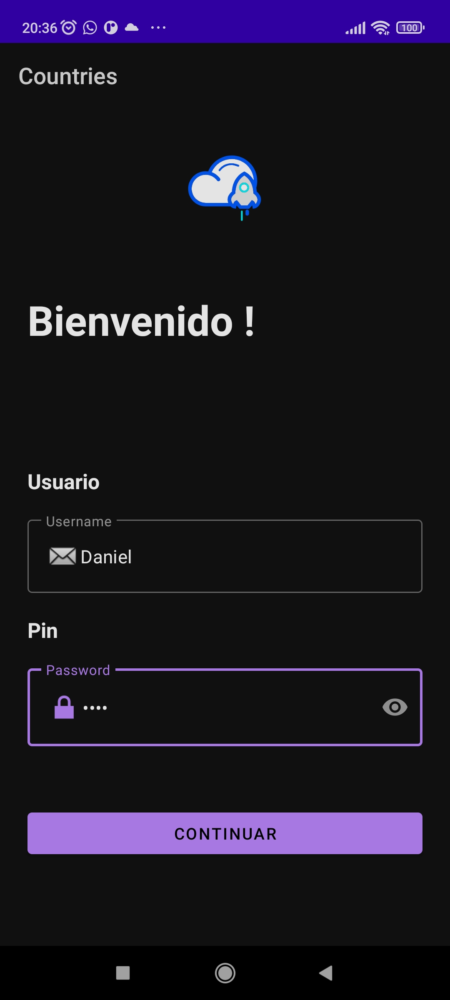
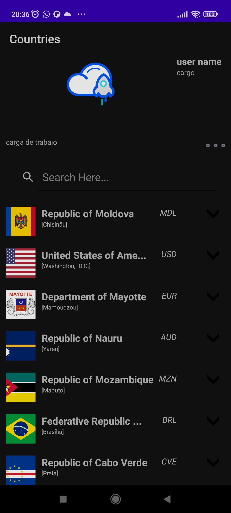
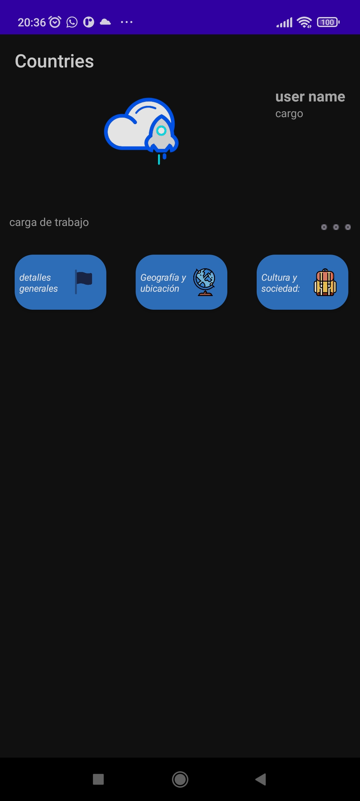
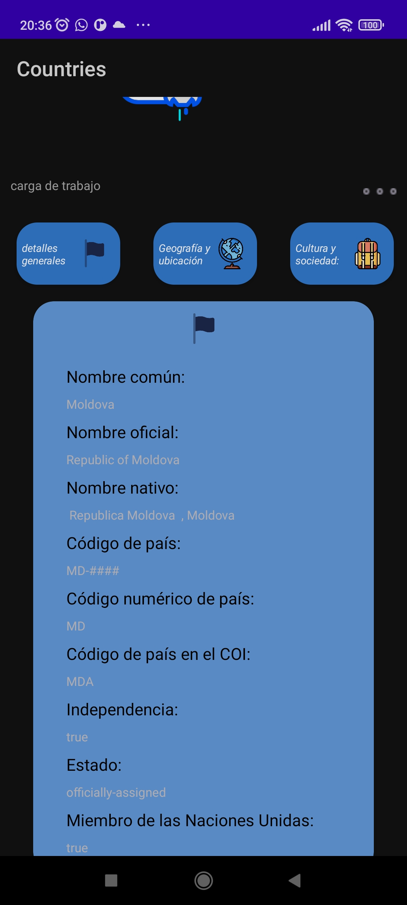
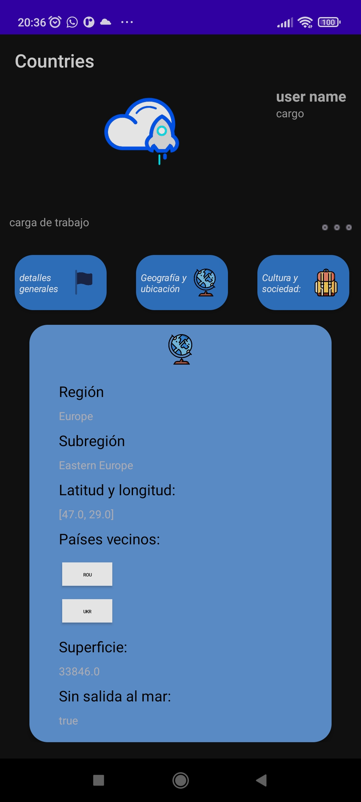
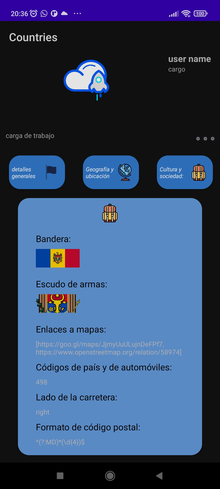
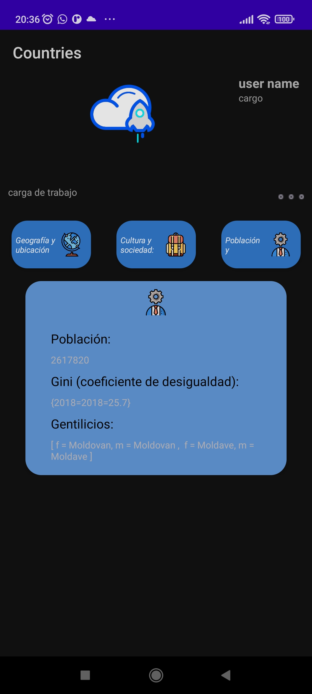
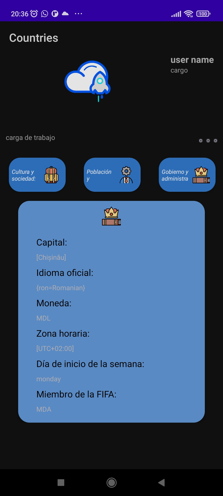

# Readme de la Aplicación Coordinadora

## Introducción
Este proyecto es una aplicación Android desarrollada en Kotlin que muestra una lista de países utilizando la API de Restcountries. La aplicación cuenta con funcionalidades básicas como búsqueda, visualización de la lista de países, visualización de resultados de la búsqueda y detalles del país,Esta aplicación, denominada "search countries", ha sido desarrollada como parte de la prueba de conocimiento en Android para el equipo de proyectos y operaciones de wireless & movil merCantil. La aplicación está diseñada para funcionar en dispositivos Android nativos con un sistema operativo mínimo de Android 8 hasta Android 14. A continuación, se detallan las características y funcionalidades implementadas en la aplicación:

## Características

- **Arquitectura**: La aplicación está desarrollada siguiendo los principios de arquitectura  MVVM (Modelo-Vista-ViewModel).
- **Base de datos local**: Se utiliza SQLite y Room Database para el manejo de la base de datos local.
- **Librerías para peticiones HTTP**: Se hacen peticiones HTTP utilizando librerías como Retrofit.
- **Inyección de dependencias**: Se implementa la inyección de dependencias utilizando Dagger.
- **Lenguaje de programación**: La aplicación esta en Kotlin.
- **Firebase**: Se utilizan servicios de Firebase para la autenticación de usuarios y el almacenamiento de datos.

## Pantallas

 video de la aplicacion : [https://youtu.be/D9gvur05iW0?si=MfSAPEI9I-EkbBLh]
### Pantalla de Login
Puedes porner cualcuer credeciales en el login dado que esta desactivado la autenticacion 

La pantalla de inicio de sesión presenta los siguientes elementos:

- Título: "Country".
- Mensaje de bienvenida.
- Campos de entrada para el código de empleado y el código PIN.

**Validaciones**:
- Si el usuario presiona Enter o el botón "Continuar", se realiza la validación en la colección de usuarios de Firebase.
- Si el usuario no está registrado en la colección, se muestra un mensaje de error.

### Pantalla de Carga de Trabajo

En esta pantalla, se muestra la carga de trabajo en forma de tarjetas, obtenida de un servicio web. El contenido de las tarjetas se muestra como se especifica en el prototipo.

**Funcionalidades**:
- El menú desplegable en la esquina superior derecha ofrece opciones como recargar la lista de carga de paises ,  y cerrar sesión.
- Al expandir una tarjeta, se puede acceder a una pantalla en orientación landscape con un mapa que muestra la ubicación de la guía seleccionada.

## Implementación y Librerías Utilizadas

La aplicación se desarrolló utilizando Kotlin y siguiendo el patrón de diseño MVVM. A continuación, se enumeran las principales librerías utilizadas:

- Retrofit para las peticiones HTTP.
- Dagger/Hilt para la inyección de dependencias.
- Room para la base de datos local.
- Firebase Authentication, Firestore, Database y Storage para la autenticación de usuarios y el almacenamiento de datos.

## Implementación de Inyección de Dependencias

Se ha realizado la inyección de dependencias utilizando Dagger/Hilt, lo que ha permitido una gestión eficiente de las dependencias y una mayor modularidad del código.

## Consideraciones Finales

- **Implementación Completa de Funcionalidades**: La aplicación ha sido implementada en su totalidad, cumpliendo con todos los requisitos especificados en la prueba. Sin embargo, se debe tener en cuenta que una parte del diseño frontend puede requerir ajustes adicionales para su completa finalización.

- **Pantalla de Mapa en Orientación Landscape**: Se ha configurado la pantalla de mapa para mantenerse en modo landscape al expandir una tarjeta desde la pantalla de carga de trabajo. Esto garantiza una visualización óptima de la informacion de la guía seleccionada en el  icon, mejorando la experiencia del usuario.

Para cualquier consulta adicional o retroalimentación, no dudes en contactar al equipo de desarrollo.

¡Gracias por tu colaboración y por utilizar la aplicación test entrevista!

